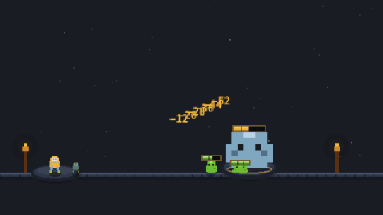
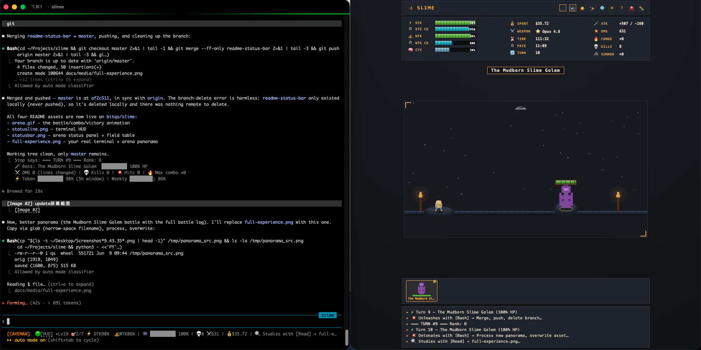
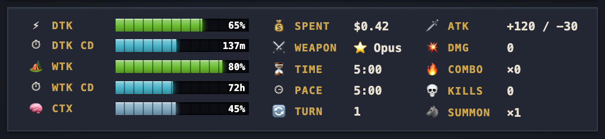
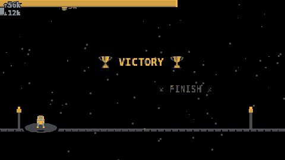
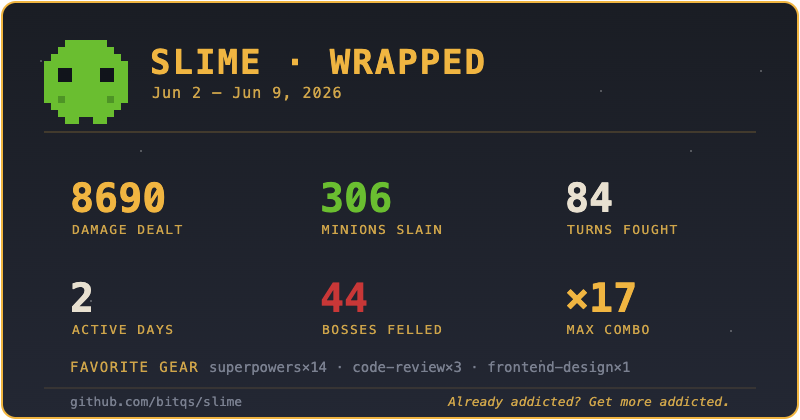

<div align="center">

# ⚔️ Slime

**Already addicted? Get more addicted.**

Your goals are the bosses. Your plugins are your gear. Watch Claude fight — over your real work, with zero impact on it.

**Every other tool lets you _watch_ your AI agent wander. Slime is the only one where you _fight and win_** — stakes, a streak, and a weekly Wrapped you'll actually share.

[](LICENSE)
[](https://docs.anthropic.com/claude-code)
[](package.json)

**English** · [中文](README.zh-CN.md)



</div>

---

Claude Code is already a turn-based game: you cast a prompt, Claude takes its turn, you wait. Slime makes the game **visible** — a full RPG layer rendered from your real session, with **zero impact on it**.

It lives right in your terminal status line — boss, token meters, streak, next quest, all at a glance. That **`[HUD]`** is a clickable link straight to the live arena:

![Slime HUD in the terminal — Cmd/Ctrl-Click [HUD] to open the arena](docs/media/open-hud.png)

## The full experience

Code in your terminal, watch the fight in the browser — one real session, zero impact on your work. The status line keeps the boss and your meters in view; the arena plays out every strike in full.



## How to read the battle

| On screen | Meaning |
|---|---|
| 🗡️ Boss | Your current quest — forged from your prompt, sized by estimated token cost |
| ❤️ Boss HP | Falls as todos complete; at 0 the boss kneels and dies automatically when the session stops |
| 🟢 Minions | Your todo list — each completed todo slays a slime |
| ⚡ Token | Your real resource — the five-hour usage window; rest to recover |
| 🔥 Combo | Consecutive successful tool strikes |
| 🍖 Feeding | Planning and Q&A feed the boss; it grows |
| 🐺 Summons | Subagent dispatches fight beside you |
| 💥 Backfire | A failed tool lets the boss counterattack — your combo breaks and the knight takes the hit |

## The status bar

The arena's top panel is your character sheet — real session telemetry in three columns: your token budgets, the run so far, and your combat output this turn.



| Field | Meaning |
|---|---|
| ⚡ **Dtk** / **Dtk CD** | Daily token budget left (the 5-hour rate window) and minutes until it resets |
| 🏕️ **Wtk** / **Wtk CD** | Weekly token budget left (the 7-day window) and hours until it resets |
| 🧠 **Ctx** | Context window used — how full the conversation is |
| 💰 **Spent** | Real session cost so far, in USD |
| ⚔️ **Weapon** | The model you're wielding (Opus / Sonnet / Haiku) |
| ⏳ **Time** · ⏲ **Pace** | Session duration, and average wall-clock time per turn |
| 🔄 **Turn** | Prompts cast this session |
| 🗡️ **Atk** · 💥 **Dmg** | Lines added / removed this turn, and total lines changed |
| 🔥 **Combo** · 💀 **Kills** | Consecutive successful tool strikes, and tests passed |
| 🐺 **Summon** | Subagent dispatches |
| 🔼 **Tokens** | ↑ uplink (input/context) and ↓ downlink (output) token counts |
| 🔥 **Streak** | Consecutive active days (best in parens) |

## Token flow

Two bars across the top of the arena turn your token usage into a live burn: **↑ uplink** (input/context) fills and heats up — gold → orange → 🔥 red — with a flame at the burning edge and a danger pulse near full; **↓ downlink** (the model's output) streams below in cool cyan. Each carries its live count, and every turn's spent tokens spray embers off the edge.



## Weekly Wrapped

Run `/slime:wrapped` for a recap of your last 7 days — and a **shareable battle card** (`wrapped.svg`) drops next to your state, ready to post:



## Quick Start

```
/plugin marketplace add bitqs/slime
/plugin install slime@slime
/reload-plugins
```

**The HUD turns itself on.** Slime's session-start hook wires the statusline into your settings automatically, so on your next session the game is just *there* — no setup step. (Already have a statusline, or prefer to do it by hand? Run `/slime:setup`. To opt out of auto-HUD, set `"autoHud": false` in `~/.claude/slime/config.json`.)

Turn on auto-update so every improvement reaches you: `/plugin` → Marketplaces → slime → Enable auto-update (third-party marketplaces ship with it off).

That's it — just work. The game plays itself.

## First run — open the arena

On your next session the HUD appears at the bottom of your terminal (shown above). To open the full battle arena in your browser, **Cmd-Click** (macOS) or **Ctrl-Click** (Windows / Linux) the **`[HUD]`** link — or run **`/slime:arena`**. Leave the tab open beside your terminal and watch the fight unfold as you work.

## Troubleshooting

- **`/plugin` not recognized?** Your Claude Code is outdated — update it (`brew upgrade claude-code` or `npm i -g @anthropic-ai/claude-code@latest`) and restart.
- **HUD not showing?** Run `/reload-plugins` (or restart Claude Code). If you already had a statusline, Slime won't overwrite it — run `/slime:setup` to switch.
- **"Plugin not found" / stale marketplace?** `/plugin marketplace update slime`, then reinstall.
- **`[HUD]` link dead / arena won't load?** The local arena server starts on first session; run **`/slime:arena`** to (re)launch it.
- **Opt out of the auto-HUD:** set `"autoHud": false` in `~/.claude/slime/config.json`.

## What You Get

| | |
|---|---|
| ⚡ **Live battle feed** | Every tool call announced JRPG-style: `🔮 Scries with [WebSearch]…` — real tool names, real-time audit |
| ⚡ **Token = your real usage** | Your five-hour window is your Token reserve — at zero, the Sage tells you exactly when you're restored |
| 🧙 **The Sage** | One line of real advice per turn: rest at low Token, potion (`/compact`) when context runs heavy, pacing warnings |
| 🗡️ **Bosses = your goals** | Your prompt names the monster; your todo list is its HP bar |
| 💀 **Kills confirm themselves** | Clear every todo and the boss falls on its own when the session ends — milestone recorded, no extra typing |
| 🏆 **Turn reports** | Rank S/A/B/C when Claude stops: damage (lines changed), kills (tests passed), max combo |
| ✦ **Level up** | Confirmed kills grant XP → levels, titles, and unlockable badges (`/slime:achievements`) |
| 🏛️ **Milestone Wall** | Every defeated boss, dated — your project chronicle |
| 💡 **Loading-screen tips** | Long waits teach you real Claude Code technique |
| 🎬 **Cinematic arena** | Boss intros, victory blowouts, combo escalation, gamified choices, boss forge with token-estimate tiers — PixiJS, vendored, still zero npm deps. Add `?calm=1` (or set OS reduced-motion) for a flash-free arena |

## The Observer Principle

Slime **never** affects real usage. No blocking, no context injection, no LLM calls by default, no auto-execution. Claude's behavior with Slime installed is byte-identical to without. Pure visuals, data, feedback.

The optional Haiku boss-namer is **off by default** and costs one tiny model call per new boss (`"haikuNaming": true` in `~/.claude/slime/config.json`).

## Speaks Your Language

Slime watches which language you prompt in and answers in kind — English and 中文 ship today. Force one with `"lang": "zh"` in `~/.claude/slime/config.json`.

## Commands

| Command | Effect |
|---|---|
| `/slime:setup` | Enable the statusline HUD |
| `/slime:achievements` | Your level, title, and badge grid |
| `/slime:milestones` | Show the Milestone Wall |
| `/slime:battlelog` | Replay this session's turn reports |
| `/slime:wrapped` | Your week in battle — shareable card |
| `/slime:arena` | Open the Pixel Arena in your browser |

### Top-of-terminal battle pane (tmux)

```bash
tmux split-window -bv -l 6 "node \"$(pwd)/scripts/watch.js\""
```

A read-only live monitor: boss bar, your Token, combo, and the last three strikes — refreshed every second.

### Pixel Arena (browser)

```
/slime:arena
```

A local pixel-art battle stage — your knight strikes in real time as Claude works. 100% local (127.0.0.1), read-only.

## How It Works

```
 your prompt ──► UserPromptSubmit ──► ⚡ boss appears
 Claude works ─► Pre/PostToolUse ───► ⚔️ battle feed (statusline)
 Claude stops ─► Stop ─────────────► 🏆 turn report card
 all todos done ─► boss falls at Stop ─► 🏛️ milestone wall
```

Hooks translate real events into game state under `~/.claude/slime/`; the statusline, tmux pane, and browser arena render it. Zero npm dependencies. Everything works offline.

## Develop

```bash
node --test test/        # full suite
npm run typecheck        # tsc --checkJs strict (run `npm install` once for devDeps)
```

No build step, no `.ts` source — TypeScript is JSDoc-only, checked with `tsc`.

## Requirements

- Claude Code (plugin system)
- Node.js ≥ 18 (already required by Claude Code itself)
- No npm dependencies, no network calls, no accounts

## Uninstall

```
/plugin uninstall slime@slime
```

Hooks are removed automatically. Two optional leftovers:

- Game data: `rm -rf ~/.claude/slime`
- Statusline: if `/slime:setup` wired the HUD, remove (or restore) the `statusLine` entry in `~/.claude/settings.json`

## License

MIT — see [LICENSE](LICENSE).

<div align="center">

**Start your quest →** `/plugin marketplace add bitqs/slime`

</div>
