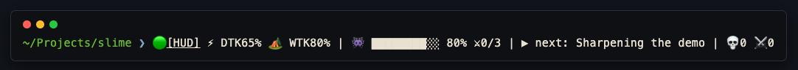

<div align="center">

# ⚔️ Slime（史莱姆）

**既然已经上瘾了,何不更上瘾一点。**

你的目标就是 Boss,你的插件就是装备。看着 Claude 替你战斗 —— 跑在你真实的工作之上,对工作本身零影响。

[](LICENSE)
[](https://docs.anthropic.com/claude-code)
[](package.json)

[English](README.md) · **中文**


</div>

---

Claude Code 本身就是个回合制游戏:你下一道 prompt(出招),Claude 走一个回合,你等着。Slime 把这场游戏**画出来** —— 在你真实的 session 之上叠一层完整的 RPG,而且**对工作零影响**。

它就活在你终端的状态栏里 —— Boss、token 余量、下一个任务,一眼尽收:



## 怎么看懂这场仗

| 屏幕上 | 含义 |
|---|---|
| 🗡️ Boss | 当前任务 —— 由你的 prompt 锻造,体型 = 预估 token 量 |
| ❤️ Boss 血条 | 随 todo 完成而下降;归零时 Boss 跪地,session 停机时自动击杀 |
| 🟢 小怪 | 你的 todo 列表 —— 每勾掉一个 todo 就斩杀一只史莱姆 |
| ⚡ Token | 你的真实资源 —— 五小时用量窗口,休息即回复 |
| 🔥 连击 | 连续成功的工具调用 |
| 🍖 喂养 | 计划与问答会喂 Boss,它会长大 |
| 🐺 召唤兽 | subagent 派遣,在你身边一起战斗 |

## 状态栏

竞技场顶部那块面板就是你的角色卡 —— 真实的 session 数据,分三列:token 余量、本场进度、本回合的战斗输出。


| 字段 | 含义 |
|---|---|
| ⚡ **Dtk** / **Dtk CD** | 当日 token 余量(5 小时速率窗口)以及距离重置的分钟数 |
| 🏕️ **Wtk** / **Wtk CD** | 每周 token 余量(7 天窗口)以及距离重置的小时数 |
| 🧠 **Ctx** | 上下文窗口占用 —— 当前对话有多满 |
| 💰 **Spent** | 本会话至今的真实花费(美元) |
| ⚔️ **Weapon** | 当前使用的模型(Opus / Sonnet / Haiku) |
| ⏳ **Time** · ⏲ **Pace** | 会话时长,以及每回合的平均墙钟时间 |
| 🔄 **Turn** | 本会话出招(prompt)次数 |
| 🗡️ **Atk** · 💥 **Dmg** | 本回合增 / 删行数,以及累计改动行数 |
| 🔥 **Combo** · 💀 **Kills** | 连续成功的工具调用,以及通过的测试数 |
| 🐺 **Summon** | subagent 派遣次数 |

## 快速开始

```
/plugin marketplace add bitqs/slime
/plugin install slime@slime
```

然后跑一次 `/slime:setup` 启用 HUD 状态栏,并打开自动更新,这样每次改进都能到你这(`/plugin` → Marketplaces → slime → Enable auto-update —— 第三方 marketplace 默认是关的)。

就这样 —— 照常工作即可,游戏会自己玩起来。

## 你能得到什么

| | |
|---|---|
| ⚡ **实时战斗播报** | 每次工具调用都用 JRPG 风格喊出来:`🔮 用 [WebSearch] 占卜…` —— 真实工具名,实时审计 |
| ⚡ **Token = 真实用量** | 五小时窗口就是你的 Token 储备 —— 归零时贤者会告诉你具体几点回满 |
| 🧙 **贤者(The Sage)** | 每回合一句真建议:Token 低了去休息、上下文重了喝药(`/compact`)、节奏预警 |
| 🗡️ **Boss = 你的目标** | prompt 给怪命名,todo 列表就是它的血条 |
| 💀 **击杀自动确认** | 勾完所有 todo,Boss 在 session 结束时自己倒下 —— 自动记录里程碑,不用多敲一个字 |
| 🏆 **回合报告** | Claude 停手时评级 S/A/B/C:伤害(改动行数)、击杀(通过测试)、最高连击 |
| ✦ **升级** | 确认击杀给 XP → 等级、称号、可解锁徽章(`/slime:achievements`) |
| 🏛️ **里程碑墙** | 每个被击败的 Boss,带日期 —— 你的项目编年史 |
| 💡 **加载页提示** | 长时间等待时,教你真正的 Claude Code 技巧 |
| 🎬 **电影级竞技场** | Boss 登场、胜利爆发、连击升级、游戏化选择、按 token 预估分级的 Boss 锻造 —— PixiJS,内置打包,依然零 npm 依赖。加 `?calm=1`(或开系统的减弱动效)即得无闪光竞技场 |

## 观察者原则(The Observer Principle)

Slime **绝不**影响真实用量。不阻塞、不注入上下文、默认不调用任何 LLM、不自动执行。装了 Slime 的 Claude 与没装时**行为逐字节一致**。纯视觉、纯数据、纯反馈。

可选的 Haiku 起名器**默认关闭**,每个新 Boss 才花一次极小的模型调用(在 `~/.claude/slime/config.json` 里设 `"haikuNaming": true`)。

## 会说你的语言

Slime 会观察你用哪种语言 prompt,并用同种语言回应 —— 目前支持 English 与中文。想强制一种,在 `~/.claude/slime/config.json` 里设 `"lang": "zh"`。

## 命令

| 命令 | 作用 |
|---|---|
| `/slime:setup` | 启用状态栏 HUD |
| `/slime:achievements` | 你的等级、称号与徽章墙 |
| `/slime:milestones` | 显示里程碑墙 |
| `/slime:battlelog` | 回放本次 session 的回合报告 |
| `/slime:wrapped` | 你这一周的战斗 —— 可分享卡片 |
| `/slime:arena` | 在浏览器里打开像素竞技场 |

### 终端顶部战斗窗格(tmux)

```bash
tmux split-window -bv -l 6 "node \"$(pwd)/scripts/watch.js\""
```

只读的实时监视器:Boss 血条、你的 Token、连击、最近三次出招 —— 每秒刷新。

### 像素竞技场(浏览器)

```
/slime:arena
```

本地像素风战斗舞台 —— Claude 工作时,你的骑士实时出招。100% 本地(127.0.0.1),只读。

## 工作原理

```
 你下 prompt ──► UserPromptSubmit ──► ⚡ Boss 出现
 Claude 工作 ─► Pre/PostToolUse ───► ⚔️ 战斗播报(状态栏)
 Claude 停手 ─► Stop ─────────────► 🏆 回合报告卡片
 todo 全勾  ─► 停机时 Boss 倒下 ──► 🏛️ 里程碑墙
```

Hook 把真实事件翻译成 `~/.claude/slime/` 下的游戏状态;状态栏、tmux 窗格、浏览器竞技场负责渲染。零 npm 依赖,全程离线可用。

## 开发

```bash
node --test test/        # 全套测试
npm run typecheck        # tsc --checkJs 严格模式(首次需 `npm install` 装 devDeps)
```

无构建步骤、无 `.ts` 源码 —— TypeScript 仅用 JSDoc 注解,由 `tsc` 检查。

## 环境要求

- Claude Code(插件系统)
- Node.js ≥ 18(Claude Code 本身已要求)
- 无 npm 依赖、无网络调用、无需账号

## 卸载

```
/plugin uninstall slime@slime
```

Hook 会被自动移除。两处可选残留:

- 游戏数据:`rm -rf ~/.claude/slime`
- 状态栏:若 `/slime:setup` 接过 HUD,删除(或还原)`~/.claude/settings.json` 里的 `statusLine` 项

## 许可

MIT —— 见 [LICENSE](LICENSE)。

<div align="center">

**开始你的征途 →** `/plugin marketplace add bitqs/slime`

</div>
